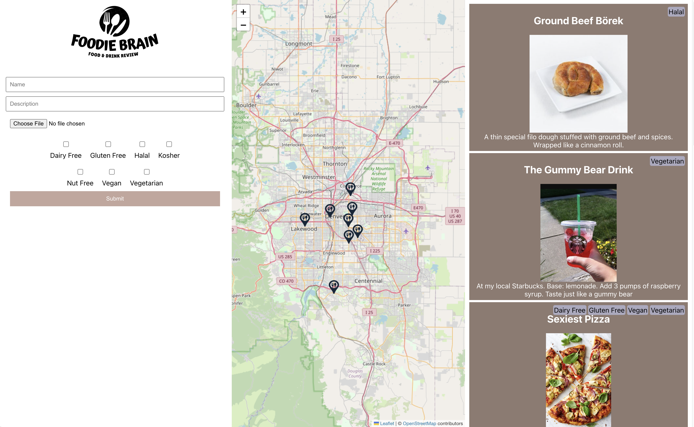
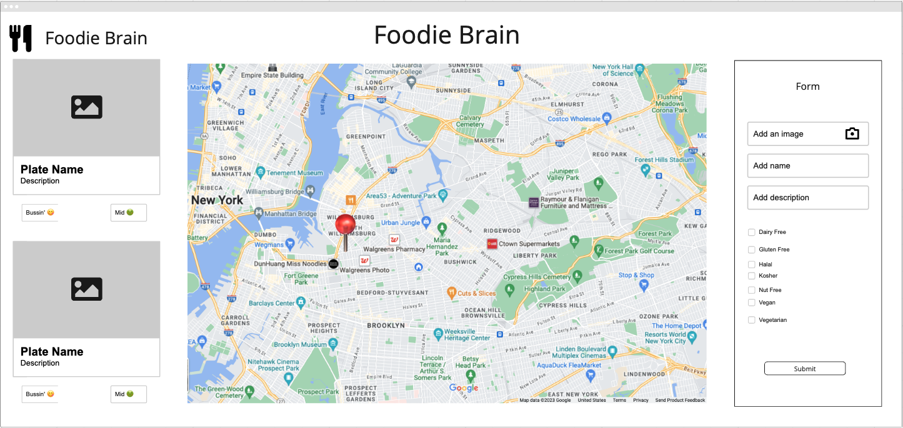

<h1> Foodie Brain Front-End </h1>

Technologies used: 

## Important Links
- [FE production site](https://foodie-brain-4c71bb461e4b.herokuapp.com/)
- [BE production site](https://be-foodie-brain-b49c609f52cc.herokuapp.com/)
- [Backend Repo](https://github.com/Foodie-Brain/be_foodie/tree/main)

## Abstract: 
An application that allows users to mark and share their favorite food spots and dishes on a map. Users will be able to see the locations mark and decide if they want to try it. It is a fast and easy way to enjoy and find new food trends and expand your taste buds. Foodie brain connects users as one, food lover application

Some quick points of Foodie Brain
- Mark and explore food spots and dishes on an interactive map.
- Share photos and reviews with fellow food enthusiasts.

# Preview of App:
 
 
  

## Wireframe

 
  

## Installation Instructions:
- Fork this repository. 
- Clone it to your local machine using the command: `git clone git@github.com:Foodie-Brain/fe_foodie.git`.
- Run the command: `cd fe_foodie`
- Run the command: `npm install`
- Run the command: `npm install apollo-upload-client`
- Run the command: `npm start`

## Contributors:

### FE Team
- Paulina Rubio [GitHub](https://github.com/paulina-isabel) | [LinkedIn](https://www.linkedin.com/in/paulina-isabel-rubio/)
- Lauren DeLaRosa [GitHub](https://github.com/LDeLaRosa13) | [LinkedIn](https://www.linkedin.com/in/lauren-delarosa-3a5a4b260/)

### BE Team
- Gabe Torres [GitHub](https://github.com/Gabe-Torres) | [LinkedIn](https://www.linkedin.com/in/gabe-torres-74a515269/)
- Weston Schutt [GitHub](https://github.com/westonio) | [LinkedIn](https://www.linkedin.com/in/westonschutt/)
- Chris Asercion [GitHub](https://github.com/ChrisAsercion) | [LinkedIn](https://www.linkedin.com/in/chris-asercion-2a7b68135/)
- Zanna Fitch [GitHub](https://github.com/z-fitch) | [LinkedIn](https://www.linkedin.com/in/zannafitch/)

